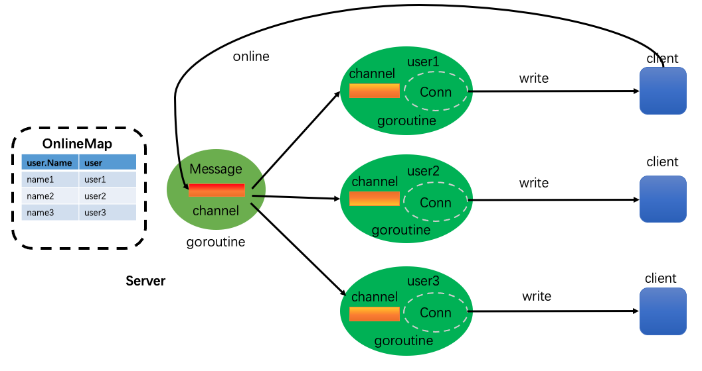

# 主要功能 major function

## 基础服务构建 Basic service construction
## 广播上线功能 Broadcast online function
## 用户消息广播 User message broadcasting
## 用户业务封装 User business encapsulation
## 在线用户查询 Online user query
## 修改用户名 Modify User Name
## 超时强踢功能 Overtime strong kick function
## 私聊功能 Private chat function
